### Talking Oxford Dictionary with Amazon Alexa

This repository contains source code for Alexa skill to access the Oxford Dictionary.

You ask Alexa the definition or meaning of some particular word and the skill orchestrates querying Oxford online dictionary via the API provided by Oxford. Results are then spoken out by Alexa for you. You can also ask Synonyms and antonyms of a word. Oxford API provides a number of useful results such as sentences, grammar or word origin. At the moment, they are not included in this code but you can enhance the code as you wish.

Alexa acts as the Voice User Interface (VUI) while the backend code is hosted on heroku as a web app written in Node.js.

Follow the steps in this readme to deploy the skill on your own.


#### Prerequisites

##### Services and Accounts

Before proceeding, you will need to create accounts for the following services.

* Amazon Developer Account - [https://developer.amazon.com/alexa](https://developer.amazon.com/alexa)
* Heroku - [https://www.heroku.com/](https://www.heroku.com/)
* Oxford Dictionary API - [https://developer.oxforddictionaries.com/](https://developer.oxforddictionaries.com/)

You will also need 'git' installed on your system. You can download git from [here](https://git-scm.com/downloads) if you don't have it on your local machine.


Though the skill code is written in Node.JS, you don't really need to install node on your local machine. Since we are hosting the app on Heroku, code execution happens on Heroku server for us.


##### Hardware

To test the skill, you can use either an Amazon Echo or similar device or go for Raspberry Pi with a slightly involved setup. Another alternative is to use products with Alexa voice services integrated such as [WisCore from RAK Wireless](http://www.rakwireless.com/en/WisKeyOSH/WisCore). The instructions to setup WisCore are provided in the [README file here](wiscore/README.md).


#### Setup Alexa Skill

#### Step 1


Login to [https://developer.amazon.com/alexa](https://developer.amazon.com/alexa) and head to Get Started->Alexa Skill kit from the Alexa Skill Kit menu.

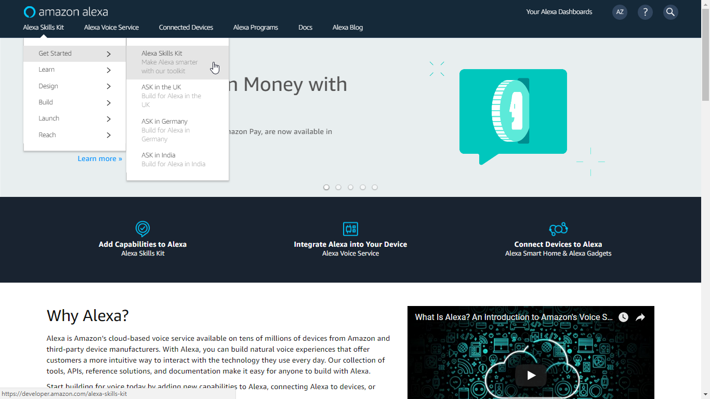


#### Step 2

Click on the 'Start a Skill' button


#### Step 3

You will be presented with a screen to configure your Alexa skill. On this first screen, give some descriptive name to the skill and an invocation name. Invocation name is important as you will use it to invoke your skill. For example, if the invocation name for your skill is 'Oxford', you will say 'Alexa, open Oxford' or 'Alexa, ask Oxford the meaning of eclipse'


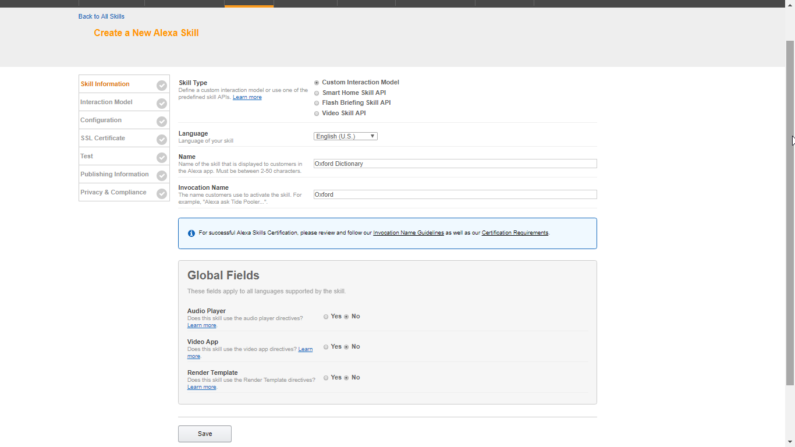


Click on the save button.


#### Step 4

An application ID will be generated and shown. Copy this ID to a text file as we will need it later when configuring the skill code to be deployed on Heroku.

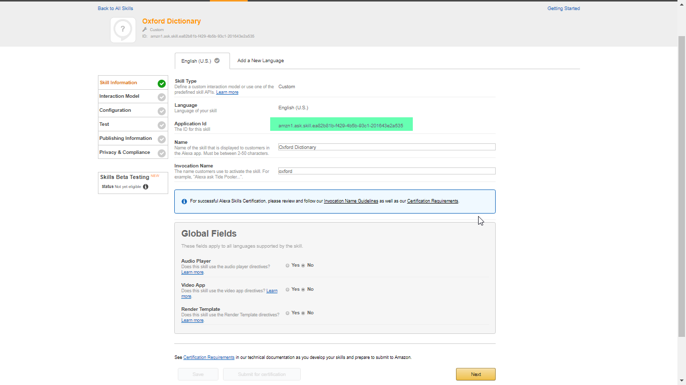

Click on the 'Next' button.

#### Step 5

Your skill is created now. You now need to tell Alexa how users will interact with this skill. So you need to configure this Voice User Interface on the next screen.

The Voice User Interface consists of intents, slots and sample utterances.

Intents are like actions - What the user intends to do. It can be that the user simply wants to open / invoke the skill or the user is asking definition of a word or synonym / antonym of a word.

Slots are similar additional parameters supplied to intents. In our case, the word for which definition or synonym/antonym is asked by the user, becomes the slot.

Finally, sample utterances are the likely sentences that the user will speak. So the sample utterances consist of intents and slots along with other parts of the sentence to make it a complete question.


##### Step 5a

From this github repository, open file [interaction/intent_schema.json](interaction/intent_schema.json)
Copy and paste entire contents of this file to the Intent Schema window.

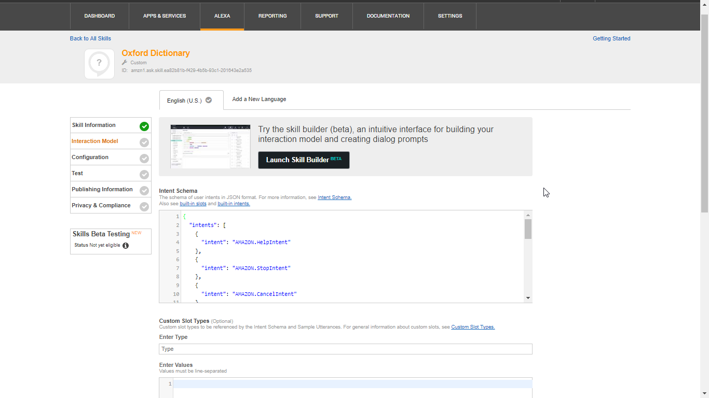


##### Step 5b

We need to create a new slot type and add in some dummy values to it. Since we don't know the word that a user wants to lookup into the dictionary, we need to give some dummy values to it.

Click on the 'Edit' button under 'Custom Slot Types'. Key in the slot type as 'ANY_WORD'.  Under 'values', put some values such as 'one', 'two', 'three', 'four' and 'five' with each word on a single row. Alexa tries to match the spoken word with these values. If it doesn't find any matching word then it will pass on the spoken word as it is to the skill code.

You can refer to file [interaction/slots.txt](interaction/slots.txt) for these values if required.

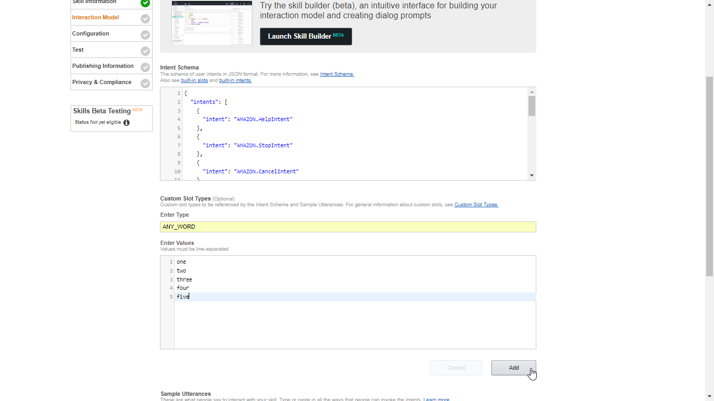

##### Step 5c

The file [interaction/slots.txt](interaction/slots.txt) contains the sample utterances that the user is expected to speak. Alexa tries to match the sentence user speaks to one of these sentences.

Copy and paste entire contents of this file into the 'Sample Utterances' window.

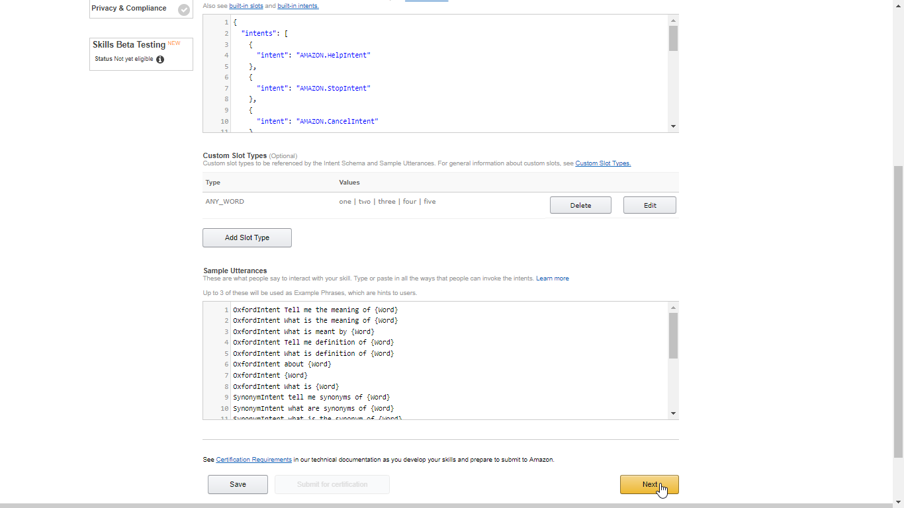


Click on 'Next' button.


#### Step 6

At this point, your skill has been created and an interaction model has been provided to the skill. Next, we need point the skill to our web app which is hosting the  execution code to access Oxford dictionary and retrieve the details.


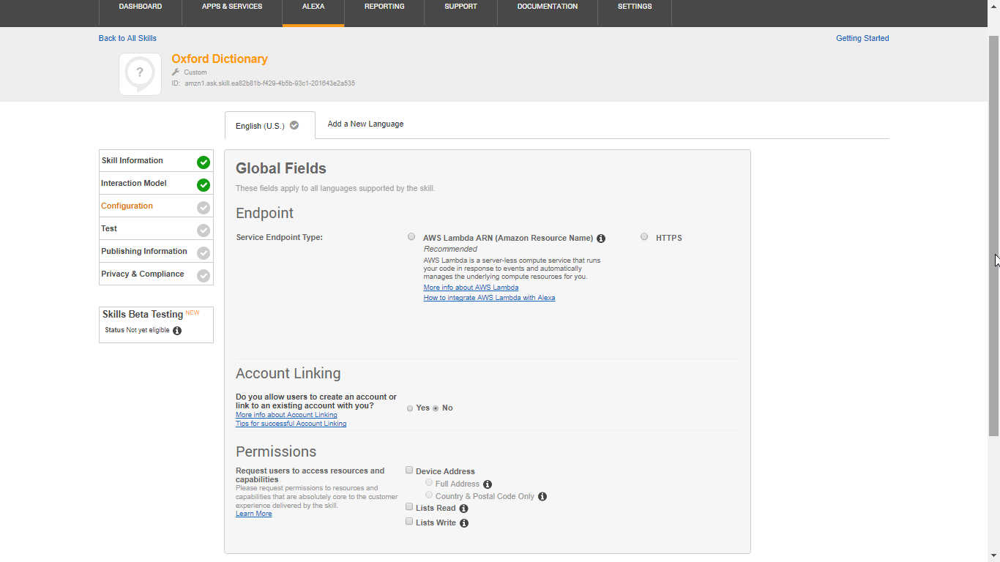


We will come back to this stage after deploying the skill code on Heroku.


#### Setup Oxford Dictionary API

#### Step 7

Before creating the Heroku web app, we need to get the credentials from Oxford Dictionary to use the API.

Sign in to [https://developer.oxforddictionaries.com](https://developer.oxforddictionaries.com) using your login ID and password.


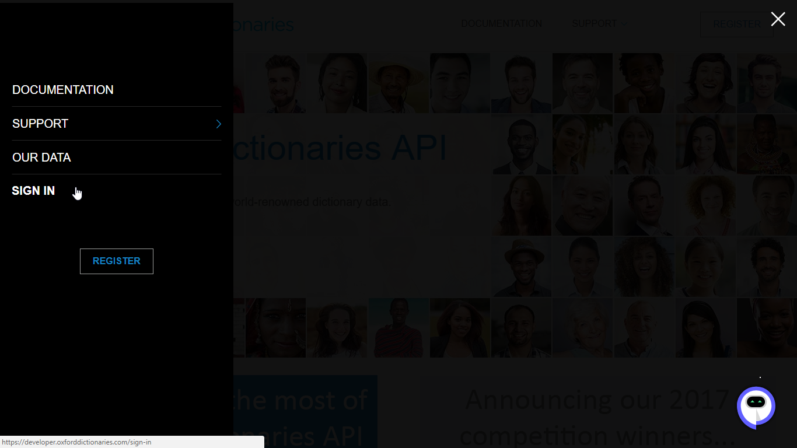


Click on 'credentials' button to get your credentials.


Click on the app name to get the application ID and the credential.


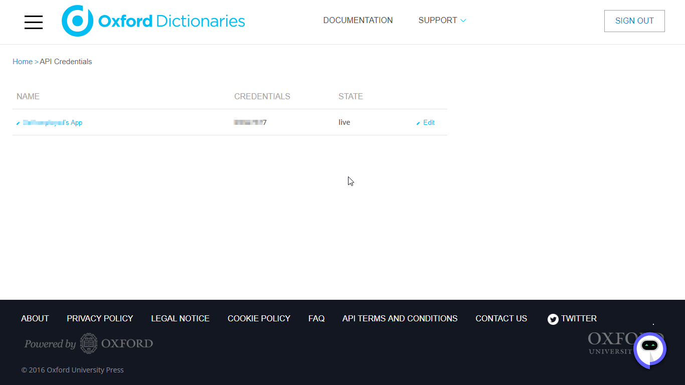


From this screen, copy the Application ID and Application Keys. We will use these details while configuring the Heroku web app.


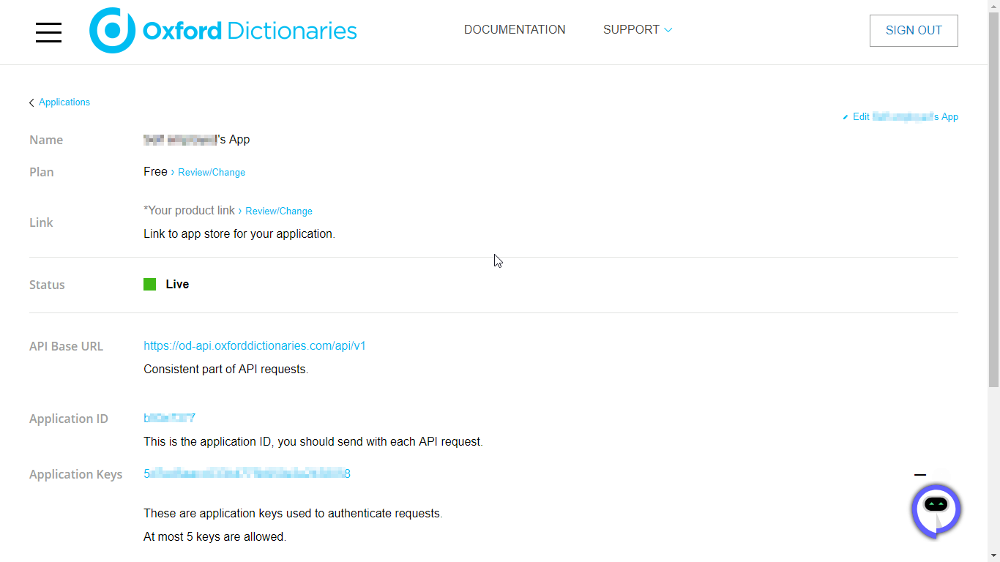


You can now sign out from the Oxford dictionary website.


#### Setup Skill Code on Heroku

#### Step 8

Let's now switch to creating our web app for the skill. Keep your heroku credentials handy.

Although you can create the heroku app completely using their web interface, the instructions here are provided for command line operation.

From [Heroku devcenter](https://devcenter.heroku.com/articles/getting-started-with-nodejs#set-up) download the Heroku CLI appropriate for your host machine.

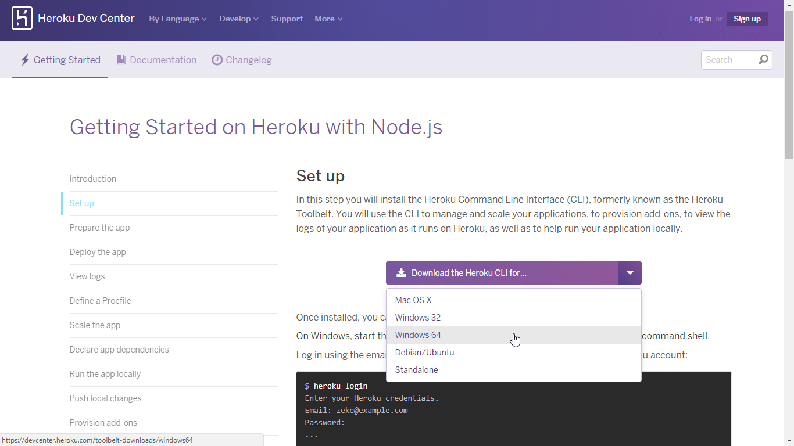


#### Step 9

Once the download finishes, run the installer to install Heroku CLI on your machine. After the installation is finished, you can use Heroku command from the command shell. If you are using windows, fire up a command prompt (cmd.exe).

Navigate to the folder where this git repository is already checked out. Login to Heroku using your credentials.

```
oxford-dictionary-alexa$ heroku login
Enter your Heroku credentials.
Email: dev@company.com
Password:
Logged in as dev@company.com
...
```

#### Step 10

Next, let's create an app on Heroku.

```
oxford-dictionary-alexa$ heroku create
Creating serene-fog-298... done
http://serene-fog-298.herokuapp.com/ | https://git.heroku.com/serene-fog-298.git
Git remote heroku added
```

So Heroku has created a web app for you now. It has assigned a random name to the app. In addition, it has created a git repository for the app source code and also added git remote to your local repository. This makes it easy to push your code to your app.


#### Step 11

Before we push the source code to the web app, we need to configure a few environment variables for our app.

* Configure variable AMAZON_APP_KEY with the Amazon app ID you got from step 4 above. This is used in the web app to authenticate that the requests are coming from your own Alexa skill only.

* Configure variable WEB_APP_ROUTE to some random value. This becomes part of the endpoint to be configured in Alexa skill. You need to make sure that this value is preceded with a forward slash. In this case, I have chosen to use 'query-oxford' as the web app route and so the value for WEB_APP_ROUTE environment variable becomes '/query-oxford'.

The web app also needs authentication details to access Oxford Dictionary API.

* Configure variable OXFORD_APP_ID to the Application ID obtained from your Oxford dictionary account in step 7 above.

* COnfigure variable OXFORD_APP_KEY to the Applicaion Key obtained from your Oxford dictionary account in step 7 above.

```
oxford-dictionary-alexa$ heroku config:set AMAZON_APP_KEY=YOUR_AMAZON_SKILL_APPLICATION_ID

oxford-dictionary-alexa$ heroku config:set WEB_APP_ROUTE=/query-oxford

oxford-dictionary-alexa$ heroku config:set OXFORD_APP_ID=YOUR_OXFORD_APP_ID

oxford-dictionary-alexa$ heroku config:set OXFORD_APP_KEY=YOUR_OXFORD_APP_KEY

```

#### Step 12

Let's now push our code to Heroku and deploy the app. A single Heroku command to push the source code takes care of uploading source code to Heroku as well as building and deploying the app.

```
oxford-dictionary-alexa$ git push heroku master
Counting objects: 20, done. ...
Writing objects: 100% (20/20), 6.10 KiB | 0 bytes/s, done.
...
remote: Building source:
remote: -----> Node.js app detected
remote: -----> Creating runtime environment
...
...
remote: -----> Build succeeded!
...
...
remote: -----> Launching
...
remote: Released v5
remote: https://serene-fog-298.herokuapp.com/ deployed to Heroku
remote: Verifying deploy... done.
To https://git.heroku.com/serene-fog-298.git * [new branch] master -> master
```

As the console output shows, the app is now deployed and running on Heroku. You can view the status of app and other details on Heroku dashboard if you wish.


#### Step 13

Make a note of the endpoint now. In this case, our app is running at https://serene-fog-298.herokuapp.com and we have configured the WEB_APP_ROUTE to 'query-oxford'. So the endpoint to access this app becomes: https://serene-fog-298.herokuapp.com/query-oxfordURL

We will need this endpoint to be configured in the Alexa skill.


#### Configure Alexa Skill Endpoint

#### Step 14

Go back to the Alexa Skill Configuration page we left in Step 6 above.


Select Service Endpoint Type as 'HTTPS'.

In the text box next to 'Default', add the complete endpoint of our web app obtained in step 13 above.


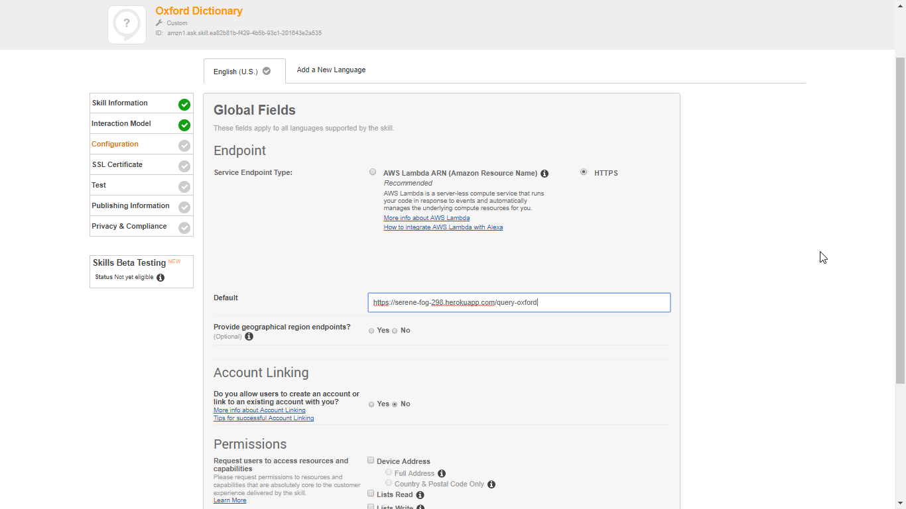

Leave other settings to default and click on 'Next'.

#### Step 15

On the next screen, select the option for SSL certificate endpoint as '*My development endpoint is a sub-domain of a domain that has a wildcard certificate from a certificate authority*'

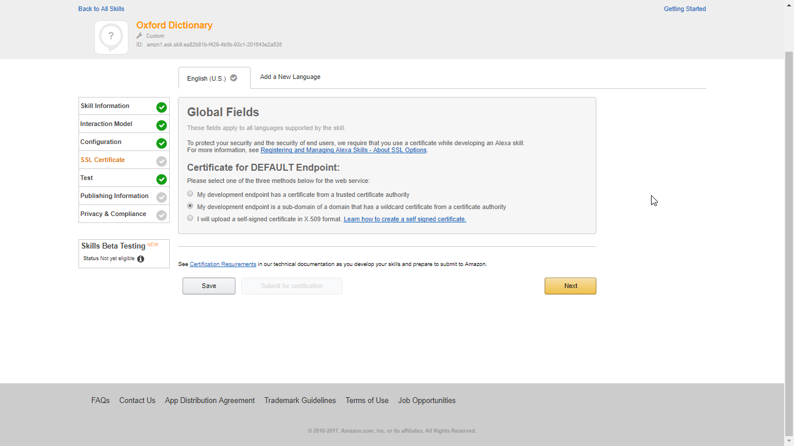

Click on 'Next'

#### Test Alexa Skill

#### Step 16


Your skill is now enabled for testing as shown by the green check marks on left side.


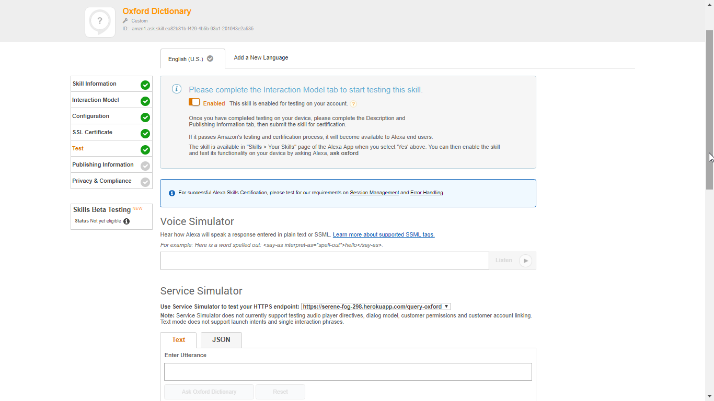


To quickly test the skill, scroll down to Service Simulator section and type in some sample utterance in the 'Enter Utterance' text box. You should get a valid answer in the Service Response text box. You can also listen to the received answer by clicking on the 'Listen' button with a speaker icon.


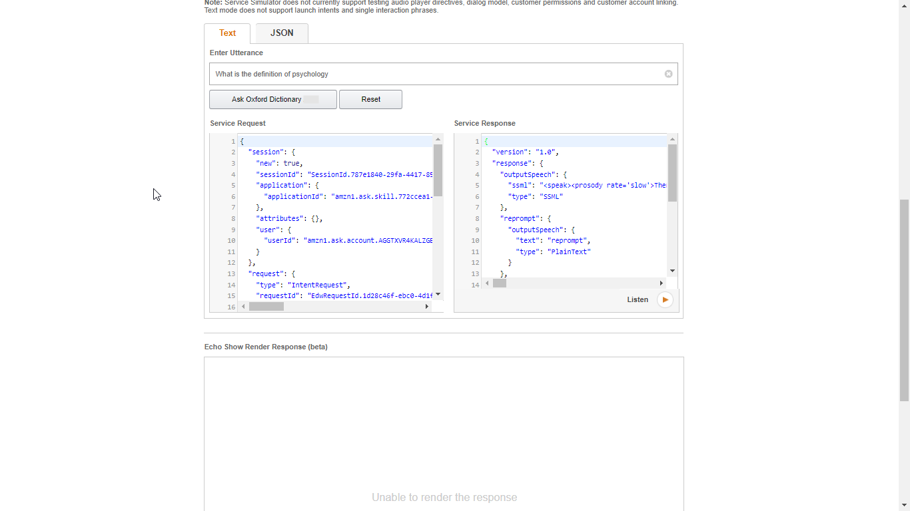


The configuration is complete now. You can test the skill with your voice using an Alexa enabled device such as Echo or a Raspberry Pi running Alexa service or the RAK Wireless Wiscore.
