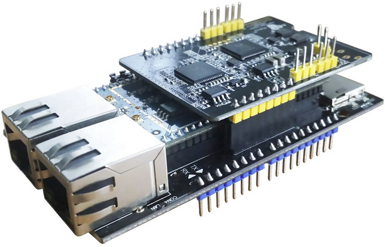

### Setup Wiscore AVS Kit for Amazon Alexa

This README briefs about how to setup the [WisCore kit](http://www.rakwireless.com/en/WisKeyOSH/WisCore) to use Alexa voice service from Amazon. Once configured, the WisCore acts exactly like an Amazon Echo or Dash products with Alexa Voice Service integrated in it. The instructions provided here are to configure WisCore using the WisCore app.

Note: This README does not include instructions to upgrade WisCore firmware. For instructions to upgrade firmware and for additional information, visit the following links.

[RAK Wireless website](http://www.rakwireless.com/en/)

[RAK Wireless support section](http://support.rakwireless.com/)

[RAK Wireless Github](https://github.com/RAKWireless/WisCore)

#### Prerequisites

1. Get hold of WisCore AVS Kit. The kit comes as a set of 3 boards which can be stacked together on top of each other. The kit can be powered by USB or external DC power supply.

2. When WisCore is run for the first time (or has been reset by pressing the reset switch for 5 seconds), the WiFi LED on the kit should be blinking at approximately 3 times a second. Make sure that the LED is blinking and proceed.

3. Download the companion WisCore app for your phone or tablet.

4. If not done already, create an account on  [developer.amazon.com](https://developer.amazon.com)

#### Step 1

Start the WisCore app. The app scans for WisCore device on the network that your phone is connected to. Since we are yet to configure our device, you will not see any WisCore device detected by the app.

#### Step 2

Click on '+' button in the app.

#### Step 3

Make sure that the WiFi LED on WisCore kit is blinking at around 3 times a second.

Select the checkbox 'The LED is fast flashing now' and click on 'Continue'.

#### Step 4

Next screen shows the WiFi network that your phone is connected to. Input the password of your WiFi router and click on Continue.

#### Step 5

The app now asks you to connect to WiFi access point of the WisCore board. The access point SSID is named as 'WisCore_xxxxxx'.

Go to settings on your phone and connect to the WisCore WiFi access point. The access point has no password by default. After successful  connection, switch back to the WisCore app.

#### Step 6

The app now tries to search for and configure the WisCore device in your network.

#### Step 7

If everything goes fine, you should see a success in finding the WisCore device.

Click on 'Let's go!'

#### Step 8

You should now see your WisCore device listed with a green icon in your app.

Click on the device for further configuration.

#### Step 8

On this screen you can see device information and network information. If you click on device information, you can see the device name, serial number and firmware version. From the network information section you can see your WiFi network to which the device is connected, the MAC address and also the IP address. You can also change the WiFi network if you wish so.

Click on the 'Amazon Alexa' section to configure WisCore to use your Amazon credentials to access Alexa voice service.

#### Step 9

Click on Sign in with Amazon to configure your credentials.

#### Step 10

Sign in with your Amazon login id and password that you used while creating account on [developer.amazon.com](https://developer.amazon.com)

You should be greeted with the Amazon Alexa screen. You have now completed setup of WisCore to access Amazon Alexa voice service. You can start using the kit with your voice to talk to Alexa.

